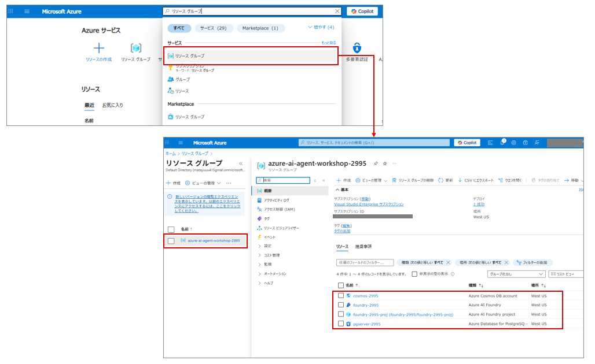
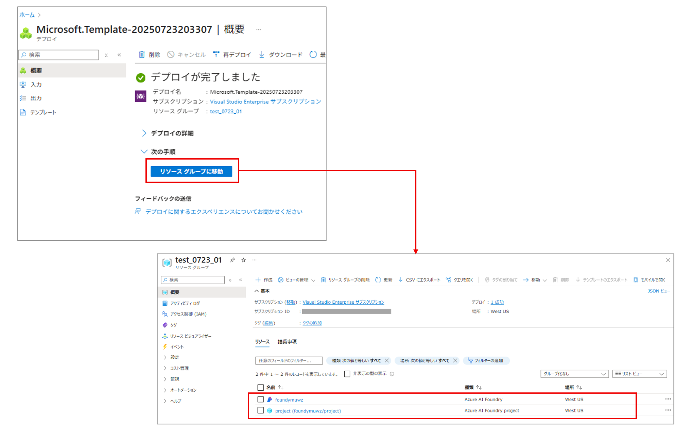

# Azure AI Agent Workshop Setup
# 開発環境の準備
## Github Codespaces の起動
1. Github にご自身のアカウントでサインイン

2. https://github.com/matayuuu/Azure-AI-Agent-Workshop にアクセスし、main ブランチであることを確認

3. [Code]ボタンをクリックし、[Codespaces]タブを選択し、[Create Codespace]をクリックします。

    

4. python 3.11 系が使える状態で、環境が立ち上がります。仮想環境作成や依存関係のインストールを行っていきます。

5. python や CLI ツールのバージョン確認
    ```
    python --version
    psql --version
    az --version
    ```


## （仮）ディレクトリの構造について
今回のハンズオンのディレクトリ構造は下記の通りです。
```
.
└── Azure-AI-Agent-Workshop
    ├── autogen-multiagent
    │   ├── autogen-multiagent.ipynb 演習3で用いるノートブック
    │   └── (略)
    ├── handson-textbook
    │   ├── ex0.md 演習0
    │   ├── ex1.md 演習1
    │   ├── ex2.md 演習2
    │   ├── ex3.md 演習3
    │   ├── ex4.md 演習4
    │   └── ex5.md 演習5
    ├── sampledata
    │   ├── users サンプルのユーザーデータが入っているフォルダ
    │   ├── code-interpreter-sample コードインタープリターで生成される画像のサンプル
    │   └── product_info.md 保険商品のサンプルデータ
    ├── single-agent
    │   ├── contract_lookup_agents.ipynb 演習2で用いるノートブック
    │   └── product_search_agents.ipynb　演習1で用いるノートブック
    └── sk-multiagent
        └── sk-multiagent.ipynb Semantic Kernel を勉強するノートブック
```

## インフラ構築
1. 依存関係のインストール
    ```
    pip install -r ./requirements.txt
    ```

2. Azure へのログイン
    ```
    az login --use-device-code
    ```

3. シェルスクリプトの実行
    ```sh
    bash ./infra/init_setup.sh
    ```

## Azure AI Foundry Project の作成
1. [Deploy to Azure by Basic Setup](https://portal.azure.com/#create/Microsoft.Template/uri/https%3A%2F%2Fraw.githubusercontent.com%2Fazure-ai-foundry%2Ffoundry-samples%2Frefs%2Fheads%2Fmain%2Fsamples%2Fmicrosoft%2Finfrastructure-setup%2F40-basic-agent-setup%2Fbasic-setup.json) をクリックすることで Azure Portal のカスタムデプロイ画面に遷移。以下のパラメータを入力し、[**確認と作成**] を押下。


    

2. Foundry Project の作成が完了すると、[**リソースグループに移動**] を押下し、リソースが作成されたことを確認

    


## 環境変数ファイルの作成＆更新
1. `.env-sample` をコピーし、同じ階層に `.env` ファイルとして保存
    ```sh
    cp .env-sample .env
    ```

2. [Azure AI Foundry Portal](https://ai.azure.com/?cid=learnDocs) をクリックして、[ライブラリ] > [Azure AI Foundry] にある [**Azure AI Foundry プロジェクト エンドポイント**] を `PROJECT_ENDPOINT` の値として更新する。

    

3. [モデル + エンドポイント] > [gpt-4o] を押下。[**ターゲット URI**] を `AZURE_OPENAI_ENDPOINT` の値として、[**キー**] を `AZURE_OPENAI_API_KEY` の値として更新する。

    

## MCP サーバの作成
