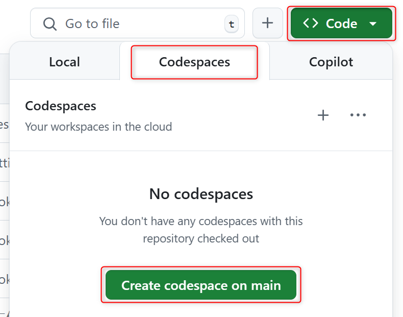
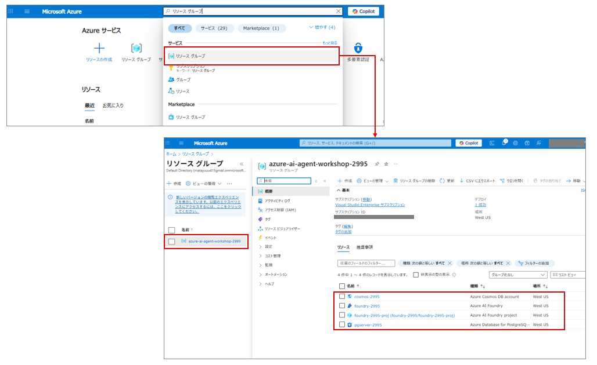
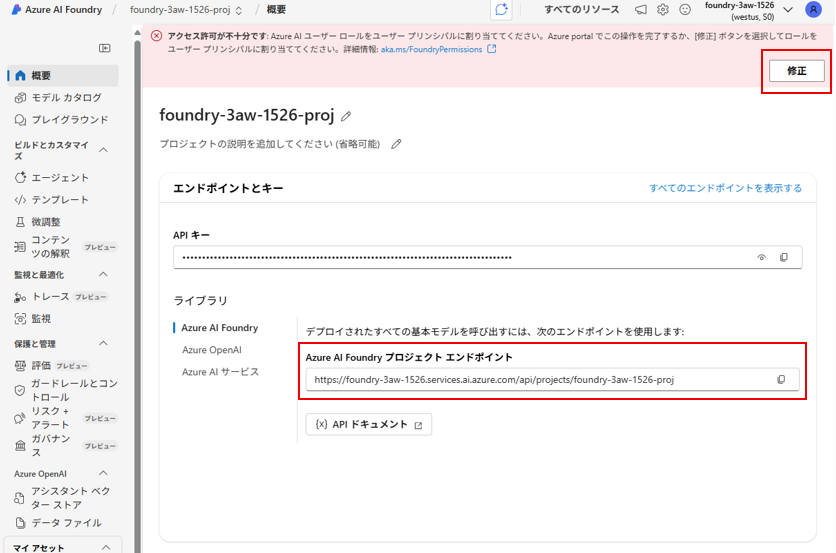
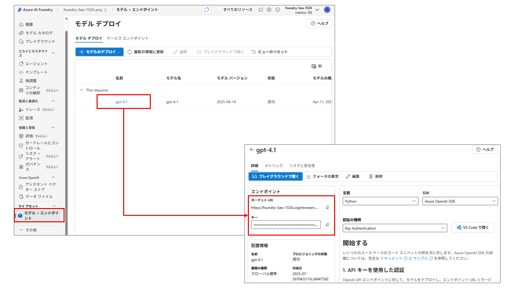

# Azure AI Agent Workshop セットアップガイド

このガイドに従って、Azure AI Agent Workshopの学習環境を構築しましょう。

## 前提条件

開始前に以下が利用可能であることを確認してください：

- **Azureサブスクリプション** 
- **GitHubアカウント**
- **インターネット接続**

## Step 1: GitHub Codespaces環境の構築

### 1.1 リポジトリへのアクセス

1. [Azure-AI-Agent-Workshop](https://github.com/matayuuu/Azure-AI-Agent-Workshop) にアクセス
2. `main` ブランチであることを確認

### 1.2 Codespaces の起動

1. **[Code]** ボタンをクリック
2. **[Codespaces]** タブを選択  
3. **[Create Codespace]** をクリック

    

    > **自動設定**: Python 3.11系とすべての必要ツールが自動でインストールされます

### 1.3 環境の確認

ターミナルを開いて、必要なツールがインストールされていることを確認：

```bash
# Python バージョン確認
python --version

# PostgreSQL クライアント確認  
psql --version

# Azure CLI 確認
az --version
```

> **期待される結果**: すべてのコマンドでバージョン情報が表示される

## Step 2: Azure インフラストラクチャの構築

### 2.1 Azure アカウントへのログイン

```bash
az login --use-device-code
```

> **認証プロセス**: ブラウザで表示されるコードを入力してAzureアカウントにログイン

### 2.2 Python 依存関係のインストール

ワークショップに必要なライブラリをCodespaces環境にインストール：

```bash
pip install -r ./requirements.txt
```

> **インストール内容**: Azure AI SDK、Semantic Kernel、データベースクライアントなど

### 2.3 Azure リソースの自動作成

以下のコマンドで必要なAzureリソースを一括作成：

```bash
bash ./infra/init_setup.sh
```

#### 作成されるリソース

| リソース | 用途 | 詳細 |
|---------|------|------|
| **Azure AI Foundry** | AIモデル管理 | プロジェクト基盤 |
| **Azure AI Foundry Project** | エージェント開発 | GPT-4oモデル含む |
| **Azure Database for PostgreSQL** | 構造化データ | SQLクエリ学習用 |
| **Azure Cosmos DB for NoSQL** | 非構造化データ | NoSQLクエリ学習用 |

> **注意**: Azure OpenAI モデルのTPM（Tokens Per Minute）クォータ制限に注意してください

### 2.4 リソース作成の確認

1. [Azure Portal](https://portal.azure.com/) にアクセス
2. 「**リソース グループ**」で検索
3. 作成されたリソースグループを確認

    

## Step 3: 環境変数の設定

作成したAzureリソースの接続情報を環境変数ファイル（`.env`）に設定します。

### 3.1 Azure AI Foundry 接続情報

1. [Azure AI Foundry Portal](https://ai.azure.com/?cid=learnDocs) にアクセス
2. **[ライブラリ]** > **[Azure AI Foundry]** を選択
3. **Azure AI Foundry プロジェクト エンドポイント** をコピー
4. `.env` ファイルの `PROJECT_ENDPOINT` に設定

> **権限エラーの場合**: Azure AI ユーザー ロールが未割り当ての場合、アラートの **[修正]** ボタンで自動権限付与



### 3.2 Azure OpenAI 接続情報

1. **[モデル + エンドポイント]** > **[gpt-4o]** を選択
2. **ターゲット URI** → `.env` の `AZURE_OPENAI_ENDPOINT` に設定
3. **キー** → `.env` の `AZURE_OPENAI_API_KEY` に設定



## Step 4: MCP サーバーの起動

Model Context Protocol（MCP）サーバーを起動して、エージェント間の通信を有効にします。

### 4.1 MCP サーバーの起動

新しいターミナルウィンドウで以下のコマンドを実行：

```bash
python .\infra\backend_services\mcp_server.py
```

> **重要**: このターミナルは閉じないでください。MCPサーバーが継続実行される必要があります。

> **ヒント**: 新しい作業用ターミナルを別途開いてください。

### 4.2 MCP サーバーの動作確認（オプション）

[MCP Inspector](https://github.com/modelcontextprotocol/inspector) を使用してWeb UIでサーバーの動作を確認できます：

```bash
# 新しいターミナルタブで実行
npx @modelcontextprotocol/inspector
```

> **結果**: ローカルホストにWeb UIが起動し、MCPサーバーの状態を確認可能


## 次のステップ

セットアップが完了したら、学習を開始しましょう：

1. **[README.md](./README.md)** で学習コンテンツを確認
2. **Azure AI Foundry Agent Service** から始める（推奨）
3. **Semantic Kernel** で高度な機能を学習

## トラブルシューティング

### よくある問題と解決方法

#### Azure OpenAI クォータエラー
```
Error: TPM (Tokens Per Minute) quota exceeded
```
**解決策**: [Azure Portal](https://portal.azure.com) でクォータ設定を確認・増加申請

#### 環境変数エラー
```
Error: Environment variable not found
```
**解決策**: `.env` ファイルの設定を再確認し、すべての必須項目が設定されているか確認

#### Python依存関係エラー
```bash
# 依存関係を再インストール
pip install --upgrade -r requirements.txt
```

---
