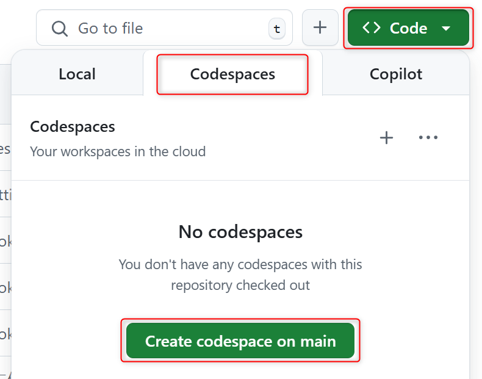
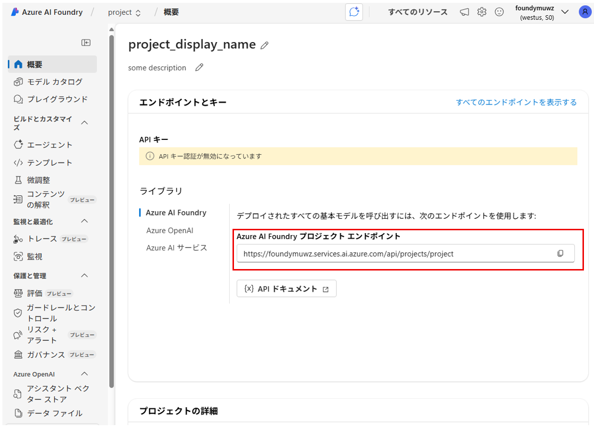
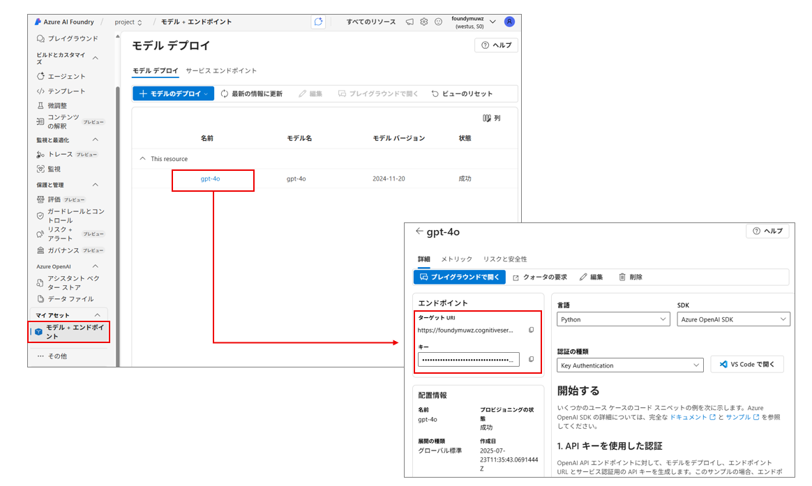

# Azure AI Agent Workshop Setup
## Github Codespaces の起動
1. https://github.com/matayuuu/Azure-AI-Agent-Workshop にアクセスし、main ブランチであることを確認

2. [Code]ボタンをクリックし、[Codespaces]タブを選択し、[Create Codespace]をクリック

    

    python 3.11 系が使える状態で、環境が立ち上がります。

3. ターミナルを開いて、Python や CLI ツールがインストールされているか確認
    ```
    python --version
    psql --version
    az --version
    ```


## （仮）ディレクトリの構造について
今回のハンズオンのディレクトリ構造は下記の通りです。
```sh
```

## インフラ構築
1. Azure へのログイン
    ```sh
    az login --use-device-code
    ```
    
2. 依存関係のインストール
    ```sh
    pip install -r ./requirements.txt
    ```

3. シェルスクリプトの実行
    ```sh
    bash ./infra/init_setup.sh
    ```

4. シェルスクリプト完了後、 [Azure Portal](https://portal.azure.com/) にアクセスして、「`リソース グループ`」で検索

    作成された [**リソースグループ**] を押下し、各リソースが作成できていることを確認

    

## 環境変数ファイル（`.env`）の更新
作成したリソースから情報を取得して、 .env ファイルの値を更新します。

1. [Azure AI Foundry Portal](https://ai.azure.com/?cid=learnDocs) にアクセスし、[ライブラリ] > [Azure AI Foundry] にある [**Azure AI Foundry プロジェクト エンドポイント**] を `PROJECT_ENDPOINT` の値として更新する。

    

2. [モデル + エンドポイント] > [gpt-4o] を押下。[**ターゲット URI**] を `AZURE_OPENAI_ENDPOINT` の値として、[**キー**] を `AZURE_OPENAI_API_KEY` の値として更新する。

    

